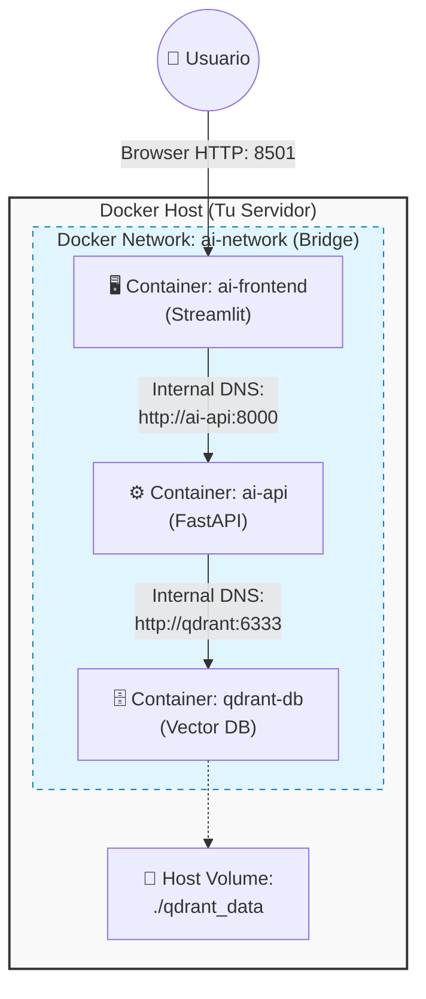

# 🤖 Agentic RAG Architecture: Dockerized & Cloud-Agnostic

> **Sistema de Inteligencia Artificial Agéntica (RAG) desplegado en microservicios contenerizados. Diseño resiliente, escalable y agnóstico a la nube.**


## 🏗️ Arquitectura del Sistema

Este proyecto implementa una arquitectura **Cloud-Native** desacoplada. Utiliza **Docker Compose** para la orquestación de servicios y **Docker Volumes** para garantizar la persistencia de datos vectoriales.



## 🛠️ Tech Stack

*   **Frontend:** Streamlit (Interfaz de Chat Reactiva).
*   **Backend API:** FastAPI (Microservicio REST).
*   **Vector Database:** Qdrant (Almacenamiento Semántico Persistente).
*   **GenAI Engine:** Groq API (Inferencia Llama 3.3-70b).
*   **Infraestructura:** Docker Compose, Docker Networks, Volumes.

## 🚀 Guía de Despliegue (Quickstart)

### Requisitos
*   Docker & Docker Compose instalados.
*   API Key de Groq (Gratuita).

### 1. Clonar el repositorio
```bash
git clone https://github.com/KorbenDallas007/agente-rag-docker.git
cd agente-rag-docker
```

### 2. Despliegue de Infraestructura
Levanta todo el stack con un solo comando. El sistema construirá las imágenes y conectará la red automáticamente.

```bash
docker compose up --build -d
```

Verifica que los 3 servicios estén corriendo:
```bash
docker compose ps
```

### 3. Ingesta de Conocimiento (ETL)
Carga los documentos base en la memoria vectorial (Qdrant).
*Nota: Este script se ejecuta localmente y se conecta a la infraestructura vía puertos expuestos.*

```bash
# (Opcional) Crea un entorno virtual
pip install -r requirements.txt

# Ejecutar ETL
python3 etl_pipeline.py
```

### 4. Acceder al Sistema
*   **Frontend Web:** Abre tu navegador en `http://localhost:8501`
*   **API Docs:** `http://localhost:8080/docs`
*   **Qdrant Dashboard:** `http://localhost:6333/dashboard`

## 📸 Demo


## 🧠 Características Avanzadas

*   **Persistencia de Datos:** El sistema utiliza volúmenes de Docker (`./qdrant_data`), lo que permite que la "memoria" de la IA sobreviva a reinicios o caídas de contenedores.
*   **Service Discovery:** Los microservicios se comunican mediante DNS interno de Docker, eliminando la dependencia de IPs fijas.
*   **Configuración Dinámica:** El Frontend lee variables de entorno (`API_URL`, `QDRANT_URL`) para adaptarse a entornos de Desarrollo o Producción.
*   **Deterministic Embedding Simulation:** Implementación de un algoritmo de hashing determinista para simular embeddings sin consumo excesivo de RAM en entornos limitados.

---
*Desarrollado por [KorbenDallas007](https://github.com/KorbenDallas007) - AI Solutions Architect Portfolio.*
```
