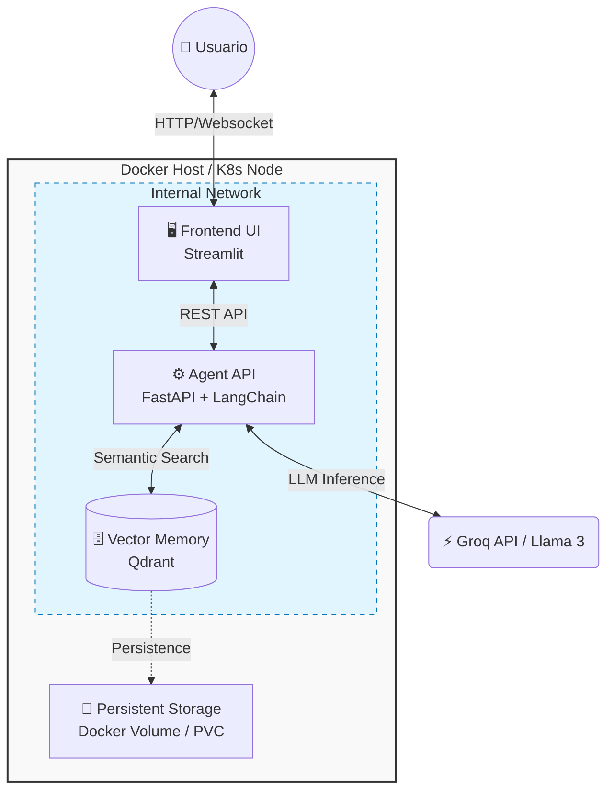

# 🤖 Enterprise AI Architect: Agentic RAG System

> **Arquitectura de IA Generativa Agéntica, Cloud-Agnostic y lista para producción. Implementa patrones de Microservicios, IaC (Terraform), Orquestación (K8s) y CI/CD.**


## 🏗️ Arquitectura del Sistema

Este proyecto demuestra el ciclo completo de ingeniería de software para IA, desde el desarrollo del agente hasta el despliegue en infraestructura escalable.



## 📂 Estructura del Repositorio

Este repositorio está organizado para cubrir todas las capas de una arquitectura Enterprise:

| Carpeta | Descripción | Stack |
| :--- | :--- | :--- |
| `app/` | **Lógica del Agente:** API, LangChain Tools, RAG Pipeline. | Python, FastAPI, LangChain |
| `k8s/` | **Orquestación:** Manifiestos para despliegue en clúster (Deployments, Services, PVC). | Kubernetes (YAML) |
| `terraform/` | **Infrastructure as Code:** Aprovisionamiento automático de VPC y EC2 en AWS. | Terraform (HCL) |
| `.github/` | **DevOps:** Pipeline de CI/CD para testing automático y build. | GitHub Actions |
| `docker-compose.yml` | **Entorno Local:** Orquestación rápida para desarrollo y pruebas. | Docker |

## 🧠 Capacidades del Agente

El sistema utiliza un **Agente Autónomo** basado en Llama 3 que decide dinámicamente qué herramienta usar:
1.  **Calculadora:** Para operaciones matemáticas precisas (evita alucinaciones numéricas).
2.  **RAG (Retrieval Augmented Generation):** Consulta la base vectorial Qdrant para responder preguntas técnicas específicas.
3.  **Memoria Persistente:** Los datos vectorizados sobreviven a reinicios gracias a volúmenes persistentes.

## 🚀 Guía de Ejecución (Quickstart)

### Opción A: Docker Compose (Local)
Ideal para desarrollo y pruebas rápidas.

1.  **Clonar y levantar:**
    ```bash
    git clone https://github.com/KorbenDallas007/agente-rag-docker.git
    cd agente-rag-docker
    docker compose up --build -d
    ```
2.  **Cargar Datos (ETL):**
    ```bash
    pip install -r requirements.txt
    python3 etl_pipeline.py
    ```
3.  **Acceder:** `http://localhost:8501`

### Opción B: Kubernetes (Simulado)
Manifiestos listos para aplicar en cualquier clúster (EKS, GKE, Minikube).
```bash
kubectl apply -f k8s/
```

### Opción C: AWS (Terraform)
Código IaC para aprovisionar infraestructura real.
```bash
cd terraform
terraform init && terraform apply
```

---
*Desarrollado por [KorbenDallas007](https://github.com/KorbenDallas007) - AI Solutions Architect Portfolio.*
```
