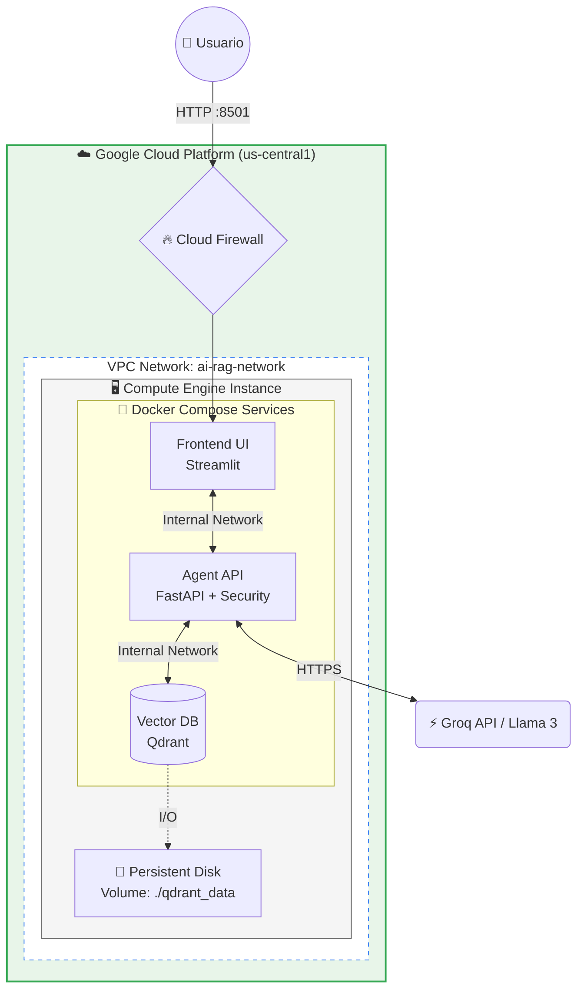

# 🤖 Enterprise AI Architect: Agentic RAG on Google Cloud

> **Sistema de IA Agéntica Autónoma desplegado en Google Cloud Platform (GCP). Arquitectura Cloud-Native, segura y escalable implementando patrones de Microservicios, IaC y CI/CD.**


## ☁️ Arquitectura de Despliegue (GCP)

La solución está diseñada para operar dentro de una **VPC** segura en Google Cloud. Utiliza **Compute Engine** para el cómputo, orquestado internamente por Docker, con persistencia en discos adjuntos y seguridad perimetral vía **Cloud Firewall**.


```mermaid
graph TD
    User((👤 Usuario))
    External_AI(⚡ Groq API / Llama 3)

    subgraph GCP ["☁️ Google Cloud Platform (us-central1)"]
        style GCP fill:#e8f5e9,stroke:#34a853,stroke-width:2px

        subgraph VPC ["VPC Network: ai-rag-network"]
            style VPC fill:#fff,stroke:#4285f4,stroke-dasharray: 5 5

            subgraph VM ["🖥️ Compute Engine Instance<br/>(Ubuntu + Docker Runtime)"]
                style VM fill:#f5f5f5,stroke:#666

                subgraph Docker_Stack ["🐳 Docker Compose Services"]
                    Frontend[Frontend UI<br/>Streamlit]
                    Backend[Agent API<br/>FastAPI + Security]
                    DB[(Vector DB<br/>Qdrant)]
                end
                
                Disk[💾 Persistent Disk<br/>Volume: ./qdrant_data]
            end
        end
        
        Firewall{🔥 Cloud Firewall}
    end

    %% Flujos de Comunicación
    User -->|HTTP :8501| Firewall
    Firewall --> Frontend
    Frontend <-->|Internal Network| Backend
    Backend <-->|Internal Network| DB
    Backend <-->|HTTPS| External_AI
    DB -.->|I/O| Disk
```

## 📂 Estructura del Proyecto

El repositorio implementa el ciclo completo de DevOps y Arquitectura Cloud:

| Carpeta | Descripción | Tecnología |
| :--- | :--- | :--- |
| `app/` | **Core Logic:** Agente autónomo con herramientas (Math + RAG). | LangChain, FastAPI |
| `terraform/` | **IaC (GCP):** Script para aprovisionar VPC, Firewall y VM automáticamente. | Terraform (HCL) |
| `k8s/` | **Escalabilidad:** Manifiestos para migración a **GKE** (Google Kubernetes Engine). | Kubernetes YAML |
| `.github/` | **CI/CD:** Pipeline de validación continua de infraestructura. | GitHub Actions |
| `docker-compose.yml` | **Orquestación:** Definición de servicios y volúmenes. | Docker |

## 🧠 Capacidades del Agente

El sistema no es un chatbot pasivo. Es un **Agente Racional** que utiliza el patrón **"ReAct"** (Reason + Act):
1.  **Seguridad:** API protegida mediante `X-Project-API-Key`.
2.  **Uso de Herramientas:** Decide si usar Calculadora (Python) o Memoria Vectorial (Qdrant).
3.  **Persistencia:** La base de conocimiento sobrevive a reinicios del servidor gracias a volúmenes persistentes.

## 🚀 Guía de Despliegue

### Opción A: Local (Docker Compose)
Para desarrollo y pruebas rápidas.
```bash
git clone https://github.com/KorbenDallas007/agente-rag-docker.git
cd agente-rag-docker
docker compose up --build -d
```
*Acceso:* `http://localhost:8501`

### Opción B: Google Cloud (Terraform)
Despliegue automático de infraestructura productiva.
```bash
cd terraform
# Autenticarse con GCP (requiere gcloud CLI instalado)
terraform init
terraform apply
```
*Esto creará la VM, instalará Docker y levantará el proyecto automáticamente mediante Startup Scripts.*

### Opción C: Kubernetes (GKE)
Para entornos Enterprise de alta disponibilidad.
```bash
kubectl apply -f k8s/
```

---
*Desarrollado por [KorbenDallas007](https://github.com/KorbenDallas007) - AI Solutions Architect Portfolio.*
